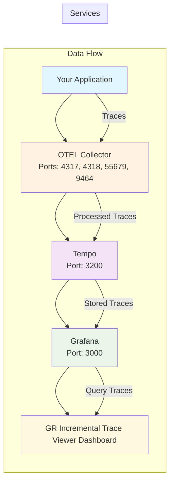

# GR Incremental Trace Viewer Dashboard

This dashboard provides an enhanced trace viewing experience for Grafana with incremental loading capabilities. It's designed to work with Tempo for distributed tracing and includes a custom panel plugin for better trace visualization.

## 🚀 Quick Start

### Prerequisites

- Docker and Docker Compose
- Bun (for development)

### 1. Start the Services

```bash
# Start all services (Grafana, Tempo, OpenTelemetry Collector)
docker-compose up -d
```

This will start:
- **Grafana** on `http://localhost:3000` (admin/admin)
- **Tempo** on `http://localhost:3200`
- **OpenTelemetry Collector** on various ports (4317, 4318, 55679, 9464)

### 2. Access the Dashboard

1. Open Grafana at `http://localhost:3000`
2. Login with `admin` / `admin`
3. Navigate to **Dashboards** → **GR Plugin** folder
4. Open the **"GR Incremental Trace Viewer"** dashboard

## 📊 Dashboard Features

### Custom Trace Panel

The dashboard includes a custom panel plugin (`gresearch-grafanaincrementaltraceviewer-panel`) that provides:

- **Incremental Loading**: Traces are loaded progressively for better performance
- **Advanced TraceQL Queries**: Support for complex trace filtering and search
- **Real-time Updates**: Live trace data updates
- **Custom Visualization**: Enhanced trace viewing experience

### Dashboard Configuration

The dashboard is automatically provisioned with:

- **Datasource**: Connected to Tempo for trace data
- **Time Range**: Default 7-day view (configurable)
- **TraceQL Query**: Empty query `{}` to show all traces (limit: 20)
- **Panel Size**: Full-width panel for optimal viewing

## 🔧 Configuration

### Docker Compose Setup

The `docker-compose.yaml` includes:

```yaml
grafana:
  volumes:
    - ./provisioning:/etc/grafana/provisioning
  environment:
    - GF_PATHS_PROVISIONING=/etc/grafana/provisioning
  depends_on:
    - tempo
```

### Provisioning Files

- **`provisioning/dashboards/dashboard.yml`**: Dashboard provider configuration
- **`provisioning/dashboards/gr-dashboard.json`**: Dashboard definition with custom panel

### Tempo Configuration

Tempo is configured with:
- **Config**: `tempo-config.yaml`
- **Ports**: 3200 (API), 9095 (metrics)
- **Storage**: Local storage (configurable for production)

## 🛠️ Development

### Building the Plugin

```bash
# Install dependencies
bun install

# Build in development mode
bun run dev

# Build for production
bun run build

# Start development server
bun run server
```

### Testing

```bash
# Run unit tests
bun run test

# Run E2E tests
bun run e2e

# Run linter
bun run lint
```

## 📈 Sample Data

To create sample trace data for testing:

```bash
# Setup OpenSearch (if using)
bun run scripts/setup-opensearch.js

# Create sample traces
bun run scripts/create-depth-trace.js
bun run scripts/create-large-trace.js
```

## 🔍 Using the Dashboard

### Basic Usage

1. **View Traces**: The dashboard automatically loads recent traces
2. **Filter Traces**: Use the TraceQL query in the panel to filter traces
3. **Time Range**: Adjust the time range to view traces from different periods
4. **Incremental Loading**: As you scroll, more traces are loaded automatically

### Advanced Features

- **Custom Queries**: Modify the TraceQL query for specific trace filtering
- **Panel Configuration**: Right-click the panel to access configuration options
- **Real-time Updates**: The panel updates automatically as new traces arrive

### TraceQL Examples

```traceql
# Show all traces
{}

# Filter by service name
{service.name="my-service"}

# Filter by operation
{operation="GET /api/users"}

# Filter by duration
{duration > 1s}

# Complex query
{service.name="api" && duration > 500ms && operation="POST"}
```

## 🚨 Troubleshooting

### Common Issues

1. **Dashboard not appearing**:
   - Check that provisioning files are mounted correctly
   - Restart Grafana container: `docker-compose restart grafana`

2. **No trace data**:
   - Verify Tempo is running: `docker-compose ps`
   - Check Tempo logs: `docker-compose logs tempo`
   - Ensure traces are being sent to the collector

3. **Plugin not loading**:
   - Check plugin installation in Grafana UI
   - Verify plugin is enabled in Grafana settings

### Logs and Debugging

```bash
# View all service logs
docker-compose logs

# View specific service logs
docker-compose logs grafana
docker-compose logs tempo
docker-compose logs otel-collector

# Enable debug mode (uncomment in docker-compose.yaml)
# - GF_LOG_LEVEL=debug
```

## 📋 Architecture



## 🔗 Related Documentation

- [Grafana Plugin Development](https://grafana.com/developers/plugin-tools/)
- [Tempo Documentation](https://grafana.com/docs/tempo/)
- [TraceQL Reference](https://grafana.com/docs/tempo/query-language/traceql/)
- [OpenTelemetry Collector](https://opentelemetry.io/docs/collector/)

## 📝 License

This project is licensed under the same terms as the main project. See [LICENSE](LICENSE) for details. 